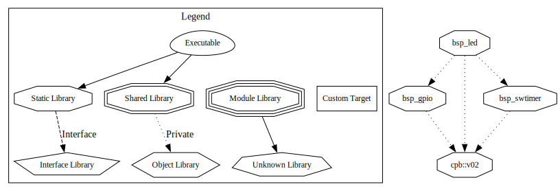

# BSP - Board Support Package

A modular Board Support Package (BSP) library for STM32F4 microcontrollers with comprehensive unit testing and CMake integration.



## Features

- 🎯 **High-level LED control** with blinking patterns (100% test coverage)
- ⚡ **Low-level GPIO** with interrupt support (97% test coverage)
- ⏱️ **Software timers** with callbacks (100% test coverage)
- 🔌 **I2C communication** with blocking and interrupt modes (93% test coverage)
- 🔄 **SPI communication** with blocking and DMA modes (98% test coverage)
- 📊 **ADC sampling** with DMA and periodic triggers (96% test coverage)
- 🚗 **CAN communication** with priority queues and event-driven callbacks (96% test coverage)
- 🧪 **Comprehensive testing** using Unity/CMock frameworks
- 🔧 **FORCE_STATIC pattern** for testable internal functions
- 📦 **CMake + CPM** for dependency management
- 🚀 **Pre-compiled HAL** for fast builds

## Quick Start

### Running Unit Tests

```bash
cmake --preset bsp-test-host
cmake --build build/bsp-test-host
ctest --preset bsp-test-host
```

### Production Build

```bash
cmake --preset bsp-gnuarm14.3
cmake --build build/bsp-gnuarm14.3
```

## Modules

| Module | Description | Coverage | Documentation |
|--------|-------------|----------|---------------|
| **bsp_common** | Shared utilities and `FORCE_STATIC` macro | - | [📖 Docs](docs/bsp_common.md) |
| **bsp_gpio** | GPIO control with interrupts | 97% | [📖 Docs](docs/bsp_gpio.md) |
| **bsp_swtimer** | Software timers with callbacks | 100% | [📖 Docs](docs/bsp_swtimer.md) |
| **bsp_led** | LED blinking patterns | 100% | [📖 Docs](docs/bsp_led.md) |
| **bsp_adc** | ADC with DMA-based periodic sampling | 96% | [📖 Docs](docs/bsp_adc.md) |
| **bsp_spi** | SPI communication (blocking + DMA) | 98% | [📖 Docs](docs/bsp_spi.md) |
| **bsp_i2c** | I2C communication (blocking + interrupt) | 93% | [📖 Docs](docs/bsp_i2c.md) |
| **bsp_can** | CAN with priority queues and callbacks | 96% | [📖 Docs](docs/bsp_can.md) |

## Documentation

- 📚 [Building](docs/building.md) - Build instructions and configuration
- 🧪 [Testing](docs/testing.md) - Unit testing guide and best practices
- 🎯 [BSP GPIO](docs/bsp_gpio.md) - GPIO module API and examples
- 💡 [BSP LED](docs/bsp_led.md) - LED control API and patterns
- ⏱️ [BSP Software Timer](docs/bsp_swtimer.md) - Timer API and usage
- 📊 [BSP ADC](docs/bsp_adc.md) - ADC sampling with DMA and callbacks
- 🔄 [BSP SPI](docs/bsp_spi.md) - SPI communication with blocking and DMA modes
- 🔌 [BSP I2C](docs/bsp_i2c.md) - I2C communication with blocking and interrupt modes
- � [BSP CAN](docs/bsp_can.md) - CAN communication with priority queues and event-driven callbacks
- �🔧 [BSP Common](docs/bsp_common.md) - FORCE_STATIC and utilities

## Usage Example

```c
#include "bsp_led.h"

LiveLed_t statusLed;

int main(void) {
    // Initialize LED
    statusLed.ePin = eM_LED1;
    LedInit(&statusLed);
    LedStart();

    // Blink at 1Hz
    LedSetPeriod(&statusLed, 500, 0);

    // Or double-blink pattern
    LedSetPeriod(&statusLed, 1000, 100);

    while(1) { /* Your code */ }
}
```

## Project Structure

```
bsp/
├── bsp_common/          # Shared utilities (FORCE_STATIC)
├── bsp_gpio/            # GPIO control
├── bsp_swtimer/         # Software timers
├── bsp_led/             # LED control
├── bsp_adc/             # ADC sampling
├── bsp_spi/             # SPI communication
├── bsp_i2c/             # I2C communication
├── bsp_can/             # CAN communication
├── tests/               # Unit tests (291 tests total)
├── docs/                # Documentation
└── CMakePresets/        # Build configurations
```

## Requirements

- **Build**: CMake 3.12+, ARM GCC 14.3 (or ARM Clang 21.1)
- **Testing**: CMake 3.12+, host compiler (no ARM toolchain needed)
- **Target**: STM32F429xx (ARM Cortex-M4F)

## Key Technologies

- **Testing**: Unity + CMock with HAL mocks
- **Build**: CMake + Ninja + CPM
- **HAL**: STM32CubeF4 v1.28.3 (pre-compiled)
- **Coverage**: gcov/gcovr (99%+ overall coverage)

## Contributing

See [Testing Guide](docs/testing.md) for test requirements. Key practices:

- Use `FORCE_STATIC` for testable internal functions
- Implement `tearDown()` to reset module state
- Aim for 100% line coverage
- Write focused, clear unit tests

## License

See project license file.

---

**Version**: 0.0.0.255
