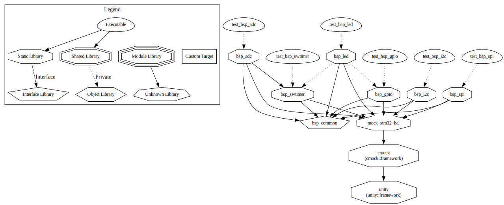

# BSP Testing Guide

Comprehensive unit testing using Unity and CMock frameworks.

## Test Coverage

- **bsp_led**: 100% line, 100% function, 95% branch (35 tests)
- **bsp_gpio**: 97% line, 100% function, 97% branch (37 tests)
- **bsp_swtimer**: 100% line, 100% function (30 tests)
- **bsp_adc**: 96% line, 100% function (36 tests)
- **bsp_spi**: 98.1% line, 100% function, 96.1% branch (74 tests)
- **bsp_i2c**: 93.3% line, 100% function, 86.8% branch (79 tests)

**Total: 291 tests across 6 modules**

### Test Dependency Graph



## Quick Start

```bash
# Configure tests
cmake --preset bsp-test-host

# Build tests
cmake --build build/bsp-test-host

# Run tests
ctest --preset bsp-test-host

# Generate coverage report
cd build/bsp-test-host
gcovr -r ../.. --html-details coverage/index.html
```

## Testing Strategy

### FORCE_STATIC Pattern

Tests can directly access internal functions using the `FORCE_STATIC` pattern:

```c
// In production code (bsp_module.c)
FORCE_STATIC void internalFunction(void) { /* ... */ }

// In test (ut_bsp_module.c)
extern void internalFunction(void);

void test_InternalFunction_Scenario(void) {
    internalFunction();  // Direct test
    TEST_ASSERT_EQUAL(expected, result);
}
```

### State Management

Always implement proper `setUp()` and `tearDown()` to reset module state:

```c
void setUp(void) {
    // Reset callback tracking
    callbackInvoked = false;

    // Free all instances to ensure clean state between tests
    for (int8_t i = 0; i < MAX_INSTANCES; i++) {
        ModuleFree(i);
    }
}

void tearDown(void) {
    // Clean up after each test - free all instances
    for (int8_t i = 0; i < MAX_INSTANCES; i++) {
        ModuleFree(i);
    }
}
```

This prevents test pollution where one test affects another. **Important**: For modules with resource allocation (SPI, I2C, ADC), use the module's Free function rather than direct memory manipulation to ensure proper cleanup.

## Test Features

- **Mock HAL**: CMock-generated mocks for STM32 HAL
- **Isolated tests**: Clean state via tearDown
- **Direct testing**: Internal functions via FORCE_STATIC
- **Fast**: All tests run on host machine in milliseconds
- **No hardware**: Pure software testing

## Writing Tests

### Basic Test Structure

```c
#include "unity.h"
#include "Mockstm32f4xx_hal.h"
#include "bsp_module.h"

extern int internalState;

void setUp(void) {
    // Initialize test fixtures
}

void tearDown(void) {
    internalState = 0;
}

void test_Module_Function_Behavior(void) {
    // Arrange
    int input = 42;

    // Act
    int result = ModuleFunction(input);

    // Assert
    TEST_ASSERT_EQUAL(expected, result);
}
```

### Testing with Mocks

```c
void test_Function_CallsHAL(void) {
    // Expect HAL function call
    HAL_GPIO_WritePin_Expect(GPIOA, GPIO_PIN_0, GPIO_PIN_SET);

    // Call function under test
    MyFunction();

    // Mock framework verifies expectations automatically
}
```

## Test Organization

```
tests/
├── bsp_gpio/
│   ├── ut_bsp_gpio.c
│   └── CMakeLists.txt
├── bsp_led/
│   ├── ut_bsp_led.c
│   └── CMakeLists.txt
├── bsp_swtimer/
│   ├── ut_bsp_swtimer.c
│   └── CMakeLists.txt
├── bsp_adc/
│   ├── ut_bsp_adc.c
│   └── CMakeLists.txt
├── bsp_spi/
│   ├── ut_bsp_spi.c
│   └── CMakeLists.txt
├── bsp_i2c/
│   ├── ut_bsp_i2c.c
│   └── CMakeLists.txt
└── cmake/
    ├── mock.stm32_hal.cmake
    ├── host.hal_def.h
    └── stm32f4xx_hal.h
```

## Coverage Goals

- **Target**: 100% line coverage, 95%+ branch coverage
- **Use FORCE_STATIC** for internal functions
- **Test all paths**: Including error conditions
- **Verify with**: `gcovr -r ../.. --filter '.*bsp_module\.c$'`

## Best Practices

1. **One assertion per test**: Keep tests focused
2. **Clear test names**: `test_Function_Scenario_ExpectedBehavior`
3. **Reset state**: Implement tearDown for all modules
4. **Mock dependencies**: Use CMock for HAL functions
5. **Test edge cases**: Null pointers, boundary conditions
6. **Direct testing**: Use FORCE_STATIC to test internals

## Troubleshooting

### Tests fail with "unexpected HAL call"
- Check mock expectations match actual calls
- Verify call order and parameters
- Use `_IgnoreAndReturn` for unimportant calls

### Low coverage despite tests passing
- Use FORCE_STATIC for internal functions
- Add tests for error paths and branches
- Check coverage report for missing lines

### State pollution between tests
- Implement proper tearDown
- Reset all FORCE_STATIC variables
- Verify test isolation

## See Also

- [BSP Common](bsp_common.md) - FORCE_STATIC pattern
- [Building](building.md) - Build configuration
